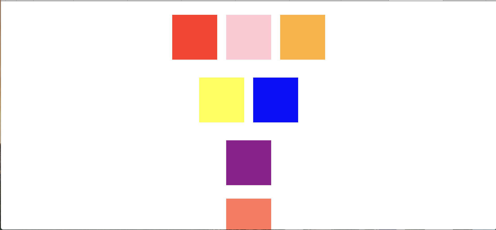

#### Introduction
As I'm sure you know from reading any fantasy/science fiction book ever, every hero needs a quest. While they're on this quest the hero inevitably encounters some variety of challenges that they must conquer to reach their end goal. Well, the time has come in your journey to master the DOM for your quest. In order to call yourself a true DOM wizard, you must complete the challenges listed below... good luck!

#### Challenges
Each challenge refers to the boxes on the row of the challenge number. For example, challenge 1 deals with the first row of boxes on the HTML page. Make sure you have a live preview up so you can see what's going on! At this point, we're jumping straight into coding in the script.js file. If you need some refreshers on how to grab elements from your HTML, add events to them, or write functions look back at the other labs that you have completed so far!

WHen you open up your live preview, Check out the console. You should see the statement "Running Click Events Script" printed. Inside the scripts folder you'll see a file "clickEvents.js". This is the file that is linked to your HTML. The first two tasks will be completed in this file.

1. You're first challenge deals with concepts that should be familiar. You'll be using a click event to alter the colors of the boxes in the first row. When you click on one of the boxes, the other two should change to be the same color as the box you clicked on. You can begin with separate functions for each box with the color hardcoded in.
  * As an additional challenge, see if you can write one named function that you can use for all three of the boxes.

2. Your second challenge is to implement a toggle functionality. When something toggles it alternates between different states. When you click on the yellow square, it should turn blue. If you click on it again it should turn back to yellow and so on. When you click on the blue square it should turn yellow, if you click on it again it should turn back to yellow and so on.
    * Implement these toggles sing the classList property. Look in the HTML to see what classes each box has.
    * Think about how you can save the current state of each box.
    * Can you write a single function that you can use with box boxes?

3. Many of the events we've looked at have focused on the mouse, but let's get the keyboard involved for this challenge. If you look inside your script file again, you'll see that there is an additional file "windowEvents.js". Go into your HTML and link this file to the page as well. You'll know that you've successfully linked the files when you reload the page and "Running Window Events Script" is also printed in your console. You'll see that there is already an event coded out in this file. This code detects when a key is pressed and prints the keycode, which is an event property. Test this out by pressing a few keys and looking in the terminal. The rest of the tasks will be in this file! Once you've familiarized yourself with the code, create your own keyboard event. Make sure that clicking any key turns the purple square into a circle and changes it to be half of its current size.

4. Once you have the keyboard event working, let's take it a step further. Make it so only pressing the "c" key makes this happen. Pressing the "s" key should revert the purple square back to its original shape and size.
    * Check out the KeyboardEvent Object notes on w3schools.com linked [here](https://www.w3schools.com/jsref/obj_keyboardevent.asp) for ideas on how you can use event properties to determine which key is being pressed.

5. Our last challenge is going to use a window event. These are events that are associated with the entire window that your website is displayed in, rather than a specific element within your document. Make sure that you have your live preview open in it's own tab. Make sure you're window is about the same size as the one below in terms of height.

  When you scroll down 50px, have the rectangle on your page turn black.

  This is a challenge that is a bit outside of what you have actually learned in lessons. Use the internet as a resource and apply what you know about DOM to this new kind of event.

#### Extensions
Let's take our last challenge a step further. In addition to making the rectangle black, make text appear at the top of your page that says "Congratulations, you are a DOM master!". Once this happens, you know you have successfully accomplished the last challenge!

For added difficulty, make the rectangle return to it's normal color and the text disappear when you scroll up.
